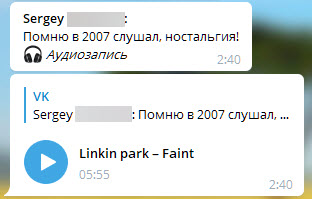

# Общие функции

- [Создание и развёртывание](installation/README.md)
- [Использование](usage/README.md)
- [Канал в Telegram](https://t.me/tg_vk) - обновления, поддержа

Бот позволяет обмениваться сообщениями ВК используя Telegram, имеется возможность пересылки сообщений, а так же выбора диалога.

Поддерживаются различные вложения

В том числе и аудиозаписи

Список диалогов

И поиск по диалогам

- [Создание и развёртывание](installation/README.md)
- [Использование](usage/README.md)
- [Канал в Telegram](https://t.me/tg_vk) - обновления, поддержа
